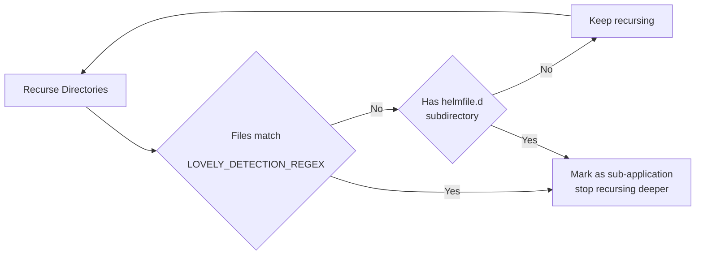
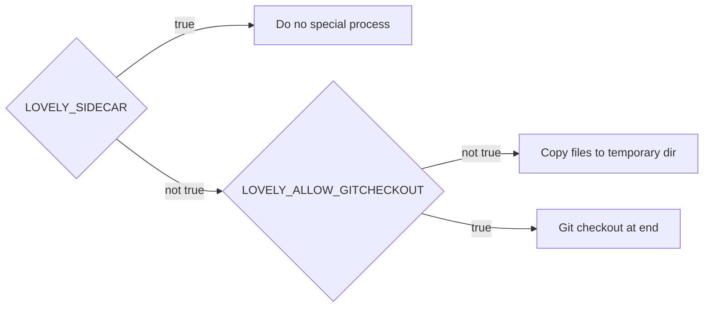
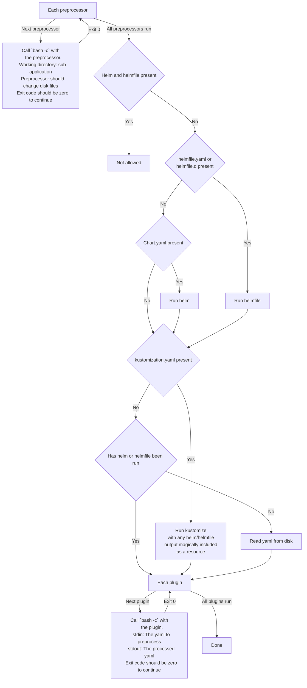

# How lovely does its thing

Lovely processes your application directory in two main steps.

1. Separate the application into sub-applications
1. Process the files found in that sub-application

## Sub-applications

Separation into sub-applications allows lovely to process each of the sub-applications independently. They can be totally different, and processed using different pipelines if you use the YAML configuration of `plugins` and `preprocessors`.

At a simple level they can just allow you to have a helm chart in one directory and some yaml in another, which is easier to read.

## Ensuring a clean copy

Lovely's processing of a sub-application can modify files. As modifications made may not be idempotent, we need to ensure we are working on an unmodified copy of the files. Lovely has 3 strategies for dealing with this:
* Sidecar: When running as a sidecar, we get a fresh copy, so lovely doesn't do anything special. The sidecar images set `LOVELY_SIDECAR=true`.
* Configmap plugin: Normally lovely will copy the sub-application folder only to a temporary folder and process them there. This means that if you refer to files outside the sub-application folder then it will not work.
* Configmap plugin with `LOVELY_ALLOW_GITCHECKOUT=true`. In this case we will perform a git checkout after processing to undo any changes made by lovely. Check [this documentation](doc/allow_git.md).

## Processing

Each sub-application is processed like this

